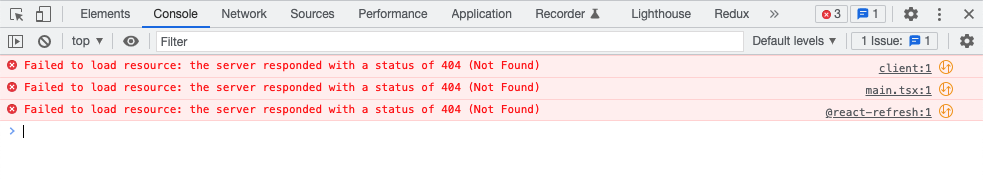

# Vercel/Vite Routing Example

This is a repository meant to illustrate a problem I'm having deploying vite applications on vercel.

The problem is I can only get client side routing to work locally (`vercel dev`), or for deployments, but not both.

## TL;DR

With _vercel.json_ client-side routing works on deployments but not locally with (`vercel dev`). Without it, routing works locally but not on deployments.

## To Reproduce

1. Clone this repository
1. Run `yarn install`
1. Run `vercel` and connect it to a vercel project
1. Visit your deployment to confirm that routing is working. You can do this by visitng the `/about` page and then refreshing.
1. Run `vercel dev` to test locally. Visiting http://localhost:3000/, you'll see the following errors:
   
1. Now move _vercel.json_ to \__vercel.json_ (or any other name) and run `vercel dev`. Routing will now be working at http://localhost:3000/about
1. Run `vercel` to deploy these changes and you'll find that routing no longer works on your deployment.
